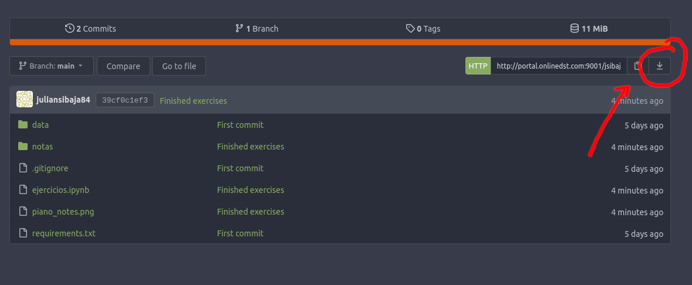

# Bootcamp

El primer Ejercicio es descargar esta carpeta satisfactoriamente y luego crear su propio repositorio a partir de esta en github. En este repositorio se deben subir los cambios de los ejercicios realizados.

Guia para descargar la carpeta del repositorio de ejercicios:

- Dirigirse a [aquí](http://portal.onlinedst.com:9001/jsibaja/exercices_pdi). Hacer click en el botón de descarga de el repositorio y seleccionar como desea descargar el repositorio.
	

- Descargar de la forma en que desee, puede ser ZIP, tar.gz etc...
Luego de haber descargado el repositorio, descomprimalo y entre en la carpeta que ha descomprimido.
- Abra una terminal y corra el siguiente comando

		jupyter notebook

- Se debe abrir una página web. Si no se abre instantaneamente se debe entonces dirigirse a un navegador e introducir la dirección que se muestra en la terminal.

- Luego de esto abrir el notebook de ejercicios *"ejercicios.ipynb"* en el navegador.

